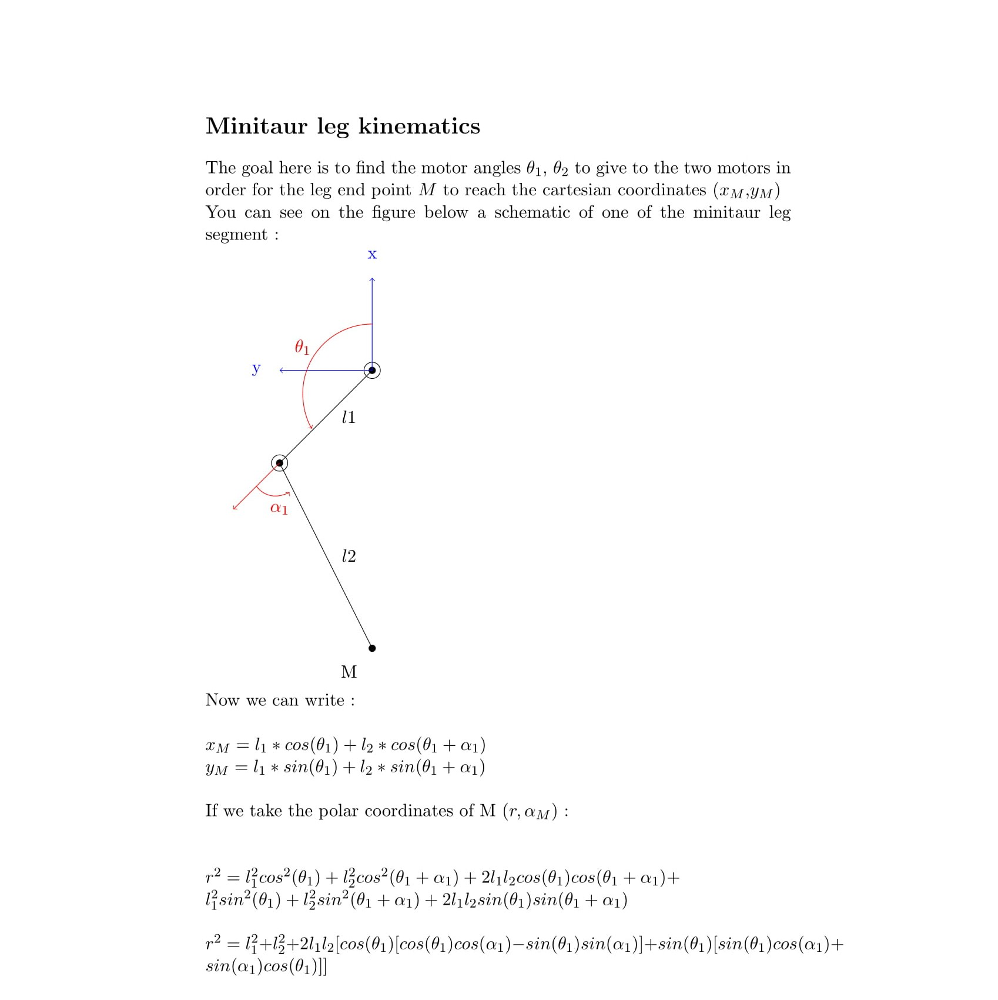
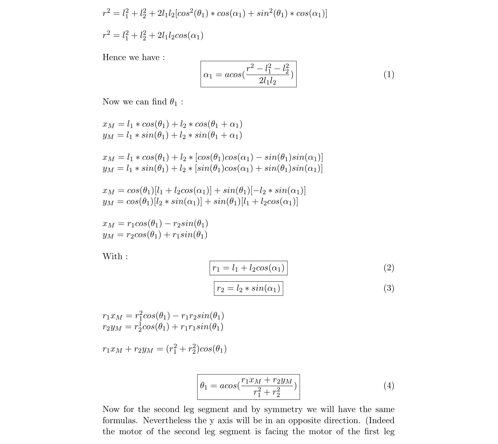

# pybullet_minitaur_sim

This repository contains everythin needed to launch a minitaur pybullet simulation and to create map_elites maps for the minitaur
The simulation is based on [this](https://github.com/bulletphysics/bullet3/tree/master/examples/pybullet/gym/pybullet_envs/minitaur/envs) work. Notice that here bullet3 is imported as a submodule in order to be able to access the minitaur urdf files in bullet3/data/

## Dependencies (use pip or your favorite package manager)
- python3
- pybullet
- numpy
- gpy
- tensorflow
- gym

Clone this repository and run :

``git submodule update --init --recursive``

## How to use this package ?

### Launch a simple simulation

```
python simulation.py
```

It will run a 20seconds minitaur episode, the controller parameters have been designed by hand.

Note that you can also run it with a Map Elites map. It will then run the best behavior from the map:

```
python simulation.py path_to_centroid_file path_to_archive_file
```


### Create map elites maps


```
python simulator_map_elites.py
```

You can tune map_elites parameters at the bottom simulator_map_elites.py. You can tune the episode duration and reward in the eval_minitaur function

If needed you can look at learn_mini.sh to launch several experiments on the cluster.

In this example the folder containing the experiment outputs is minitaur_20secs. You will need to create it before executing ``` ./learn_mini.sh ```

#### References:
If you use this code in a scientific paper, please cite:

**Main paper**: Mouret JB, Clune J. Illuminating search spaces by mapping elites. arXiv preprint arXiv:1504.04909. 2015 Apr 20.

**CVT Map-Elites**: Vassiliades V, Chatzilygeroudis K, Mouret JB. Using centroidal voronoi tessellations to scale up the multi-dimensional archive of phenotypic elites algorithm. IEEE Transactions on Evolutionary Computation. 2017 Aug 3.

**Variation operator**: Vassiliades V, Mouret JB. Discovering the Elite Hypervolume by Leveraging Interspecies Correlation. Proc. of GECCO 2018.


###  Launch a simple simulation with a damaged minitaur

You can use the eval_minitaur function from simulator_map_elites_damaged.py to run a simulation with a damage.

 Here the left front leg is blocked in a fully retracted and perpendicular to the ground position.

simulator_map_elites_damaged.py is the file that is used by the [pyite](https://github.com/resibots/pyite.git) package

## Minitaur leg kinematics

The following is used in the simulation, to convert cartesian end leg position commands to angle commands. You can also directly look at the  minitaur.pdf file




